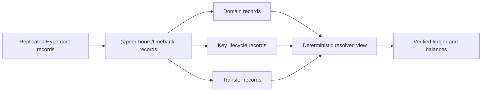

# @peer-hours/timebank-records

`@peer-hours/timebank-records` is the record-protocol composition layer for Peer Hours. It defines immutable envelopes for timebank events and turns replicated record histories into the existing domain, identity, settlement, and ledger inputs.

It is an internal workspace package today (`private: true`), not a published npm package.

## Intended role



This package is the adapter between replicated data and pure timebank rules. It owns the shared event envelope, member-signed envelope admission, record-kind mappings, replay/conflict detection, and deterministic read models. It does not replace the underlying domain packages.

`resolveTimebankMemberFeeds()` is the feed-aware resolver. It accepts records grouped by known Hypercore member-feed key, reads valid root-signed feed declarations first, and then rejects a published listing, proposal, or settlement record that was not supplied through a feed declared by its author. `resolveTimebankRecords()` remains the lower-level compatibility resolver for a flat record history and cannot make that source claim by itself.

## Boundaries

- `@peer-hours/peer-runtime` owns local Hypercore storage and network transport.
- `@peer-hours/timebank-domain` owns member, listing, and agreement rules.
- `@peer-hours/timebank-identity` owns key lifecycle reduction and Ed25519 transfer verification.
- `@peer-hours/timebank-settlement` owns proposal-to-transfer matching.
- `@peer-hours/timebank-ledger` owns verified transfer application and balances.

The record protocol must never place business rules solely in serialization or transport adapters. It should make every replicated event traceable to one of those pure boundaries.

## Not yet a trust protocol

Accepted-proposal and transfer records now require an active, community-scoped member key to sign every immutable envelope term before the resolver admits them. That protects the current deterministic read model from unsigned, tampered, inactive-key, cross-community, and unrelated-member submissions.

The resolver also applies the implemented record-authorship rules:

- A published-listing envelope must be authored and signed by its member owner.
- An accepted-proposal envelope must be authored and signed by the member recorded as accepting that proposal. A proposal creator cannot publish an acceptance on the other member's behalf.
- A settlement-transfer envelope may be authored and signed by either its provider or its recipient. Separately, the ledger requires valid attestations from **both** participants over the exact transfer terms before it derives balances. The envelope author is the submitter of the replicated record, not a substitute for the second attestation.

An integration test proves the narrow protocol path with two isolated `PeerRuntime` instances and no community peer: a direct Corestore connection carries signed feed declarations, published offer/request records, an accepted proposal, and a dual-attested settlement, which resolve to identical balances on both sides. A second integration test starts with no remote feed key and uses a signed, expiring announcement over a shared discovery-core key to open the remote feed automatically.

This is not the complete trust protocol. The runtime can exchange signed, expiring announcements for declared feeds once peers share a discovery-core scope, but key rotation/recovery, private identity metadata, user-controlled filtering, and multiwriter ordering remain protocol work. Peer Hours has decided against membership approval as the participation gate; a valid self-owned root declaration can now authorize member signatures, while the older supplied authorization-list verifier remains a compatibility boundary. The desktop UI cannot yet publish or guide this workflow, so the verified protocol path is not yet an exposed member feature.

## Development

```sh
npm --workspace @peer-hours/timebank-records test
npm --workspace @peer-hours/timebank-records run typecheck
npm --workspace @peer-hours/timebank-records run build
```
