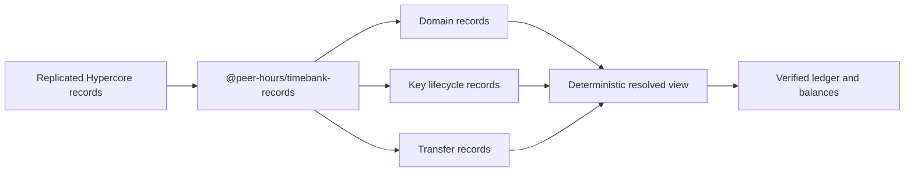

# @peer-hours/timebank-records

`@peer-hours/timebank-records` is the record-protocol composition layer for Peer Hours. It defines immutable envelopes for timebank events and turns replicated record histories into the existing domain, identity, settlement, and ledger inputs.

It is an internal workspace package today (`private: true`), not a published npm package.

## Intended role



This package is the adapter between replicated data and pure timebank rules. It owns the shared event envelope, record-kind mappings, replay/conflict detection, and deterministic read models. It does not replace the underlying domain packages.

## Boundaries

- `@peer-hours/peer-runtime` owns local Hypercore storage and network transport.
- `@peer-hours/timebank-domain` owns member, listing, and agreement rules.
- `@peer-hours/timebank-identity` owns key lifecycle reduction and Ed25519 transfer verification.
- `@peer-hours/timebank-settlement` owns proposal-to-transfer matching.
- `@peer-hours/timebank-ledger` owns verified transfer application and balances.

The record protocol must never place business rules solely in serialization or transport adapters. It should make every replicated event traceable to one of those pure boundaries.

## Not yet a trust protocol

The first record shape makes histories deterministic and safe to replay. The desktop and node now open a live, community-owned record core, but the shape does not yet make a network-received record trustworthy: community authority, signatures on authorization events, access policy, and multiwriter ordering remain protocol work. Desktop members cannot yet write timebank records to the shared core.

## Development

```sh
npm --workspace @peer-hours/timebank-records test
npm --workspace @peer-hours/timebank-records run typecheck
npm --workspace @peer-hours/timebank-records run build
```
