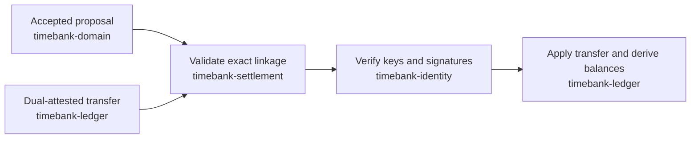

# @peer-hours/timebank-settlement

This package is the narrow bridge between an accepted exchange proposal and a normal ledger transfer. It ensures that a transfer cannot settle an exchange merely by naming a proposal ID: its community, participants, and minutes must exactly match the accepted proposal.

It is an internal workspace package today (`private: true`), not a published npm package.

See the [package architecture](../../docs/package-architecture.md) for the full ecosystem map and [proposal settlement integration](../../docs/proposal-settlement-integration.md) for the rule in context.

## Responsibility

`validateSettlementTransfer` accepts an `ExchangeProposal` from `@peer-hours/timebank-domain` and a `Transfer` from `@peer-hours/timebank-ledger`. It returns the normalized transfer only when all of the following are true:

- the proposal is accepted and records its accepting participant;
- the transfer is a normal settlement, not a compensating reversal;
- `sourceProposalId` equals the proposal ID;
- community, provider, recipient, and minute amount exactly match the proposal.

`createDualConfirmedSettlementTransfer` is the stricter composition entry point for new
publication flows. It accepts an already accepted proposal, both participant acknowledgements,
and two participant attestations. It derives the transfer id as
`<proposal-id>/settlement`, copies every economic term from the proposal, and refuses to compose
anything until acknowledgement resolution is `dual-confirmed`. The attestations are structurally
checked by the ledger contract, but must still be cryptographically verified by the identity
package before a resolver applies the transfer.

## What it does not do

- It does not verify Ed25519 signatures or key authorization; use `@peer-hours/timebank-identity`.
- It does not derive postings, calculate balances, or detect duplicate settlement across a collection; use `@peer-hours/timebank-ledger`.
- It does not load replicated records. A future application or persistence adapter must resolve the proposal before calling this package.
- It does not create, edit, or accept proposals; use `@peer-hours/timebank-domain`.
- It does not decide that a replicated transfer is final or durable. A community replication
  acknowledgement policy must be met separately before a product may call the exchange settled.

## Public API

`validateSettlementTransfer({ proposal, transfer })` returns the normalized `Transfer` when the linkage is valid and throws `SettlementRuleError` when it is not. Callers should verify attestations separately, then pass a valid identity verifier to `@peer-hours/timebank-ledger` when applying a collection of transfers.

For new member-feed publication paths, use
`createDualConfirmedSettlementTransfer({ proposal, acknowledgements, attestations })` and then
encode the result with the records package. This package does not publish or replicate the record.

## Role in the ecosystem



The package intentionally depends on the domain and ledger contracts, while those lower-level packages do not depend on it. That preserves a clean composition boundary for desktop, node, and future record-replication adapters.

## Dependencies

- `@peer-hours/timebank-domain` for the accepted-proposal contract.
- `@peer-hours/timebank-ledger` for the normalized transfer contract.

It deliberately does not depend on `@peer-hours/timebank-identity`, networking, storage, or a UI package.

## Development

```sh
npm --workspace @peer-hours/timebank-settlement test
npm --workspace @peer-hours/timebank-settlement run typecheck
npm --workspace @peer-hours/timebank-settlement run build
```
